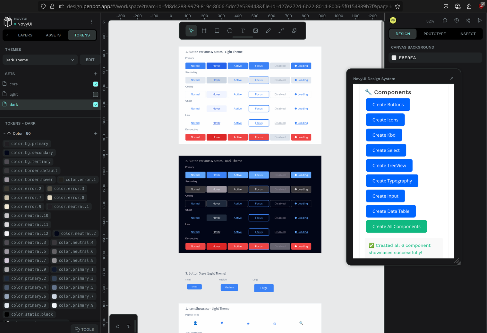

# NovyUI PenPot Plugin (Experimental)

**Status**: Working plugin prototype, not production-ready due to missing PenPot features

This plugin demonstrates NovyUI design system integration with PenPot, creating 6 core UI components with proper styling and design tokens. While functional, it serves as a proof-of-concept until PenPot implements component variants.

## Current Status (June 29, 2025)

### ✅ What Works
- **NovyUI Plugin**: Creates 6 components (Button, Icon, Kbd, Select, TreeView, Typography) with accurate MoonZoon styling
- **Design Tokens**: 113 design tokens imported (33 colors, 18 spacing, 25 typography, etc.) with light/dark theme support
- **Layout System**: Flex layouts with workarounds for padding issues
- **Live Demo**: Plugin successfully generates components in PenPot

### 📸 Plugin in Action


*Plugin interface with generated Button components in light/dark themes*

  
*Design tokens imported and organized in PenPot*

### 🎬 Demo Video
https://github.com/user-attachments/assets/3a0bb392-7f21-42cb-8b1f-15c206255fb6

*Full plugin workflow and NovyWave interface creation demonstration*

## 🚧 Critical Limitations

### 1. **No Component Variants** (Primary Blocker)
- Requires **313 individual components** instead of 18 components with variants
- Button alone needs 36 separate components (6 variants × 6 states)
- Community consensus: ["Component variants were the deciding factor for Figma"](https://github.com/penpot/penpot/discussions/534)
- **Status**: [Highly requested since 2021](https://community.penpot.app/t/any-update-on-component-variants/6558), no clear timeline

### 2. **Plugin API Token Limitations**
- Cannot set token references: `element.fills = [{ fillColor: "{color.primary.7}" }]` doesn't work
- Must use hardcoded hex colors, breaking dynamic theming
- No programmatic token management through plugin API

### 3. **Layout Issues**
- Flex layout padding properties don't work consistently
- Workaround: Transparent spacer rectangles for proper spacing

## 🚀 Quick Start

```bash
# 1. Start plugin dev server
cd PenPot/novyui-plugin
npm run dev

# 2. Install plugin in PenPot from:
https://localhost:4400/manifest.json

# 3. Click "NovyUI Design System" in plugins menu
```

## 📦 Implemented Components

**Core UI Elements** (6 of 18 total):
- **Button**: All 6 variants with proper state handling
- **Icon**: 4 size variants with semantic naming  
- **Kbd**: Keyboard shortcuts with depth effects
- **Select**: Dropdown states with chevron animations
- **TreeView**: Hierarchical structure with indentation
- **Typography**: Complete type scale with 7 variants

**Remaining**: Input, TextArea, Checkbox, Switch, FileInput, Badge, Avatar, Card, Alert, Accordion, List, Pattern

## 🔮 Future Direction

PenPot is *almost* production-ready for design systems. Waiting for:
1. **Component Variants** - Primary missing functionality
2. **Plugin API Token Management** - For programmatic token handling
3. **Layout Padding Fixes** - For proper flex spacing

**Current Strategy**: Design in Figma, build in MoonZoon, maintain PenPot readiness. Migration will proceed when critical blockers are resolved.

## 📋 Full Report

See [report_29-06-2025.md](./report_29-06-2025.md) for complete technical details, implementation insights, and future roadmap analysis.

---

**Project Structure**: `tokens/` (W3C design tokens) • `novyui-plugin/` (plugin source) • `docs/` (migration documentation) • `assets/` (icons, fonts, patterns)