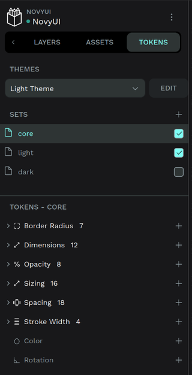

# PenPot Design System Automation Status Report
**Date**: June 29, 2025

## 🎯 TL;DR
PenPot plugin works for creating individual components but can't build a complete design system yet. The critical missing PenPot functionality - **component variants** - is still in development. Until then, the project uses Figma for actual design work while keeping PenPot automation ready for when it matures.

## 📊 Current Status

### Plugin Components & Design Tokens in PenPot 🎨


This screenshot shows the NovyUI plugin workflow in PenPot:
- **Left sidebar**: 113 design tokens imported and organized (color.primary.*, color.neutral.*, etc.)
- **Main canvas**: Button components in both light and dark themes with all variants and states
- **Right sidebar**: Plugin interface with component creation buttons and success confirmation



*Note: Design tokens were imported manually from JSON files through PenPot's GUI, as the Plugin API cannot manage design tokens yet. PenPot's token functionality was added recently and plugin API access is not yet available.*

### What Has Been Implemented ✅
- **NovyUI Plugin**: Successfully creates 6 components (Button, Icon, Kbd, Select, TreeView, Typography) with proper styling - these are the core UI elements needed for designing the NovyWave project
- **Design Tokens**: 113 design tokens converted and importable (33 colors, 18 spacing, 25 typography, etc.) - light/dark theme support ready
- **Layout System**: Flex layouts work with workarounds (transparent spacer rectangles for broken padding functionality)
- **Visual Accuracy**: Implemented components approximate the MoonZoon implementation styling

### Plugin Demo Video 🎬

https://github.com/user-attachments/assets/3a0bb392-7f21-42cb-8b1f-15c206255fb6

The demo demonstrates the plugin's component creation capabilities and NovyWave interface design creation in PenPot.

*Note: The video file `plugin_demo.mp4` is also located in `./docs/`*

## 🚧 Critical Blockers

### 1. **No Component Variants** (Primary Blocker)
Instead of 18 components with variants, the system needs **313 individual components**. Example:
- Button alone needs 36 separate components (6 variants × 6 states)
- No way to switch between Primary/Secondary/Ghost variants
- Community consensus: ["Component variants were the deciding factor for Figma"](https://github.com/penpot/penpot/discussions/534)

**Status**: [Community discussion #534](https://github.com/penpot/penpot/discussions/534) - highly requested since 2021, not included in PenPot 2.0 (April 2024), [no clear timeline](https://community.penpot.app/t/any-update-on-component-variants/6558) for implementation

### 2. **Plugin API Can't Set Token References**
```typescript
// ❌ What's needed (doesn't work)
element.fills = [{ fillColor: "{color.primary.7}" }];

// ✅ What works (but breaks theming)
element.fills = [{ fillColor: "#3B82F6" }]; // hardcoded hex
```

**Impact**: Must create duplicate components for each theme. No dynamic theme switching.

### 3. **No Plugin API for Design Tokens**
Plugin API cannot manage design tokens at all - no programmatic import, update, or reference capabilities.

**Impact**: 
- Must manually import tokens through GUI (no automation possible)
- Cannot programmatically update token values or create new tokens
- Plugin development workflow completely separate from token management

**Status**: No timeline for plugin API token access

### 4. **Layout Padding Issues**
Flex layout padding properties don't work as expected through the plugin API. Testing revealed:
- Initially appeared that horizontal padding worked while vertical didn't
- Further testing showed both paddingLeft/Right and paddingTop/Bottom fail in flex layouts
- Elements touch borders despite proper padding settings
- Workaround: Transparent spacer rectangles as invisible padding elements

*Note: No minimal test case has been created to isolate this issue or report it to PenPot developers.*

## 🛠️ How to Run the Plugin

```bash
# 1. Start the plugin dev server
cd PenPot/novyui-plugin
npm run dev

# 2. Open PenPot and install plugin from:
https://localhost:4400/manifest.json

# 3. Click "NovyUI Design System" in plugins menu
```

**Pro tip**: The dev server now auto-recompiles on file changes

## 🎨 What's Been Built

### Components Migration from MoonZoon (6 of 18)
These components were prioritized as they're the core UI elements needed for designing the NovyWave project:
- **Button Component**: All 6 variants with proper state handling
- **Icon Library**: 4 size variants with semantic naming
- **Kbd Shortcuts**: Physical keyboard appearance with depth effects
- **Select Dropdowns**: Open/closed states with chevron animations
- **TreeView**: Hierarchical structure with proper indentation
- **Typography**: Complete type scale with 7 variants

### Not Yet Implemented (12 remaining)
Input, TextArea, Checkbox, Switch, FileInput, Badge, Avatar, Card, Alert, Accordion, List, Pattern

### NovyWave Interface Demo
Created a draft recreation of the NovyWave app interface until PenPot is more mature:


## 💡 Key Insights from Implementation

### Unexpected Findings
- PenPot's manual UI works well - plugin API has significant limitations
- HTTPS requirement for cloud PenPot wasn't documented (cryptic CORS errors)
- Unicode invisible characters can hide individual board labels (though PenPot GUI has toggle to hide all)
- Transparent spacer rectangles work as padding workaround but add complexity
- Had some problems with Cloudflare bot protection while testing PenPot cloud API


## 🔮 Future Direction

PenPot is *almost* there. The foundation is solid, the token system is best-in-class, and the open-source nature aligns with NovyUI's philosophy. But without resolving the critical blockers, it's not ready for production design system use.

### Waiting For
1. **Component Variants** - The primary missing functionality for scalable design systems
2. **Plugin API Token Management** - For programmatic token import/update and dynamic theming
3. **Plugin API Token References** - To link elements to design tokens instead of hardcoded values
4. **Layout Padding Fixes** - For proper flex layout spacing without workarounds
5. **[PenPot Fest 2025](https://penpot.app/penpotfest)** (Oct 8-10, Madrid) - Previous Fest announced Grid Layout and Tokens Studio partnership

**Current Strategy**: Keep building in MoonZoon, design in Figma, maintain PenPot readiness. When the critical blockers are resolved, the project will be ready to migrate fully.

---
