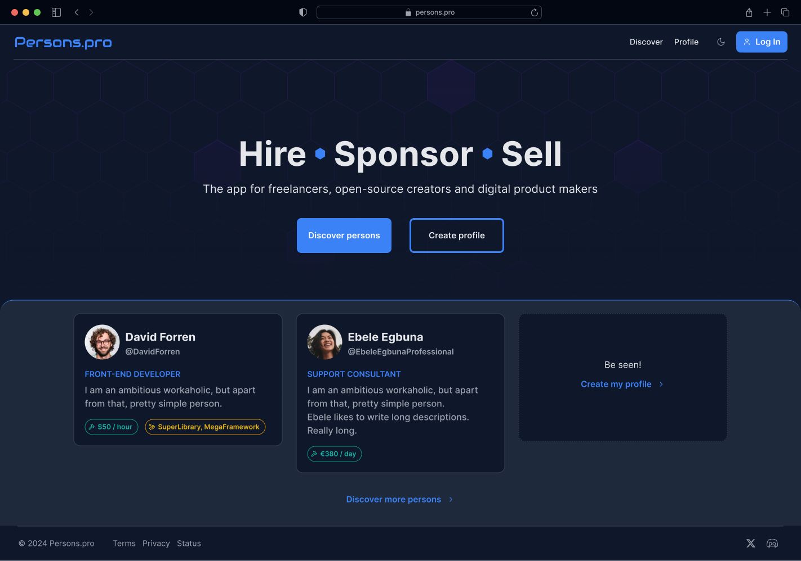
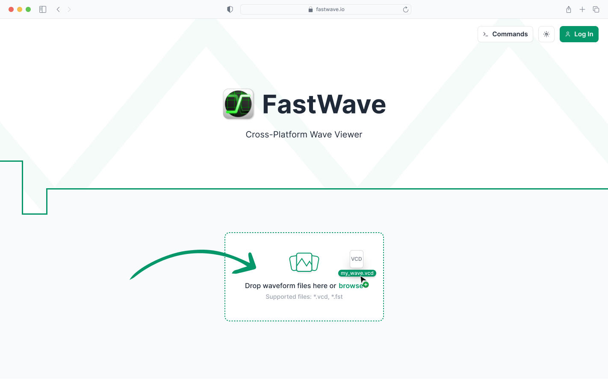
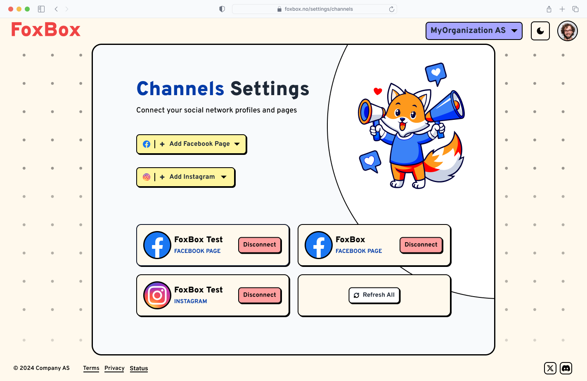

# NovyUI
> A timeless, configurable design system built for modern web applications.

_Warning: Work in Progress - Production use not recommended yet_


## Overview

NovyUI is a comprehensive design system that provides consistent, accessible, and highly configurable UI components across multiple frameworks and platforms. Built with a token-based architecture, it ensures design consistency while maintaining flexibility for customization.

**Key Features:**
- 🎨 **Token-based design system** with 15+ design token categories
- 🔧 **Multi-framework support** (Rust/MoonZoon, Vue/TypeScript, Boon)
- ♿ **Accessibility-first** approach with WCAG compliance
- 📱 **Responsive design** patterns and mobile-optimized components
- 🎯 **Type-safe** implementation across all supported frameworks
- 🚀 **Production-ready** components, blocks, and page templates

## Live Demos & Implementations

### 🌊 NovyWave (Production Application)
- **🚀 Real-world usage:** [NovyWave](https://github.com/NovyWave/NovyWave) - A Rust desktop application built with [Tauri](https://tauri.app/) using NovyUI
- Demonstrates NovyUI components in a production desktop environment
- Part of the same GitHub organization, showcasing the design system's cross-platform capabilities

### MoonZoon Storybook (Rust)
- **🌐 Live Demo: [moonzoon-novyui-storybook.kavik.cz](https://moonzoon-novyui-storybook.kavik.cz/)**
- NovyUI implementation for Rust fullstack framework [MoonZoon](https://github.com/MoonZoon/MoonZoon)
- Type-safe components written entirely in Rust with NovyUI
- **Source:** [./moonzoon-novyui](moonzoon-novyui)

### Vue Storybook (TypeScript) - LEGACY
- **🌐 Live Demo: [vue-novyui-storybook.kavik.cz](https://vue-novyui-storybook.kavik.cz/)**
- NovyUI Vue 3 + TypeScript component library
- Built with [Storybook.js](https://github.com/storybookjs/storybook) for component documentation
- **Source:** [./storybook](storybook)

### PenPot Design System - NEW
- **🎨 Visual Design System:** Complete PenPot design system based on NovyUI MoonZoon implementation
- **🔄 Token-Driven:** W3C-compliant design tokens with automatic light/dark theme support
- **📋 Component Library:** 18 core components with 313 variants for comprehensive design coverage
- **Source:** [./PenPot](PenPot)

### Boon Storybook (Coming Soon)
- NovyUI implementation for programming language [Boon](https://github.com/BoonLang/boon)
- Components and Storybook written entirely in Boon with NovyUI
- _Status: In development_

---

## Why NovyUI?

### Timeless Design Philosophy

You'll always need buttons, checkboxes, inputs, and navigation in your applications. NovyUI provides:

- **🏗️ Essential Building Blocks:** Comprehensive component library covering all fundamental UI patterns
- **📚 Best Practices Built-In:** Each component follows established UX patterns and accessibility guidelines
- **🎓 Learning Resources:** Extensive documentation with implementation examples and design rationale
- **🤖 AI-Friendly:** Structured documentation and token system designed for both human developers and AI assistants
- **⚡ Time-Saving:** Pre-built, tested components eliminate the tedious work of creating basic UI elements
- **📐 Design System Knowledge:** Embeds years of design system expertise and industry standards

**Common Pain Points NovyUI Solves:**
- Inconsistent spacing, colors, and typography across applications
- Accessibility overlooked or implemented incorrectly
- Reinventing the wheel for basic UI components
- Lack of comprehensive documentation and usage examples
- Difficulty maintaining design consistency across teams and projects

### Configurable Architecture

NovyUI's token-based system provides unparalleled customization flexibility:

- **🎨 Design Tokens:** 15+ token categories (color, spacing, typography, shadows, etc.) for consistent theming
- **🔧 Component Variants:** Multiple visual styles (primary, secondary, outline, ghost) for each component
- **📱 Responsive Patterns:** Built-in mobile-first responsive design patterns
- **🎯 Framework Agnostic:** Consistent design tokens work across Rust, Vue, Boon, and future implementations
- **📦 Automatic Asset Management:** Scripts automatically download and sync fonts, icons, and pattern assets
- **🛠️ Custom Component Patterns:** Clear guidelines and templates for creating new components that fit the system

**Tooling & Automation:**
- Automated asset synchronization (fonts from Google Fonts and other sources, icons from Lucide, patterns from Hero Patterns)
- Documentation enforcement scripts ensure consistency across all components
- Template generators for creating new components, blocks, and pages
- Design file exports for Figma/Penpot integration

### Design Exploration Examples

The following designs demonstrate the visual range possible with NovyUI's configurable token system. Each represents a different aesthetic approach achievable by customizing the design tokens while using the same underlying components:

#### Friendly & Rounded - Approachable Interface

*Soft, rounded design with gentle colors and friendly typography - ideal for consumer apps and tools people use daily.*

#### Modern Minimalism - Clean Professional Interface

*Clean, professional design with subtle shadows and modern typography - perfect for business applications.*

#### Neobrutalism - Bold Digital Expression  

*High-contrast, geometric design with bold colors and sharp edges - showcases how NovyUI tokens can create striking, unconventional interfaces.*

These examples show how the same NovyUI component library can produce dramatically different visual results simply by adjusting design tokens (colors, spacing, corner radius, shadows, typography). The underlying accessibility, functionality, and code quality remain consistent across all variations.

*Note: The above design examples were created in Figma to demonstrate (future) NovyUI's visual flexibility.*

## Getting Started

### Quick Start

1. **Choose Your Framework:**
   - **Rust/MoonZoon:** See [./moonzoon-novyui](moonzoon-novyui) for installation and usage
   - **Vue/TypeScript:** See [./storybook](storybook) for npm package and setup
   - **Boon:** Coming soon

2. **Explore Components:**
   - Browse the [live demos](#live-demos--implementations) to see all available components
   - Review component documentation in [./components](components)
   - Check out pre-built page layouts in [./blocks](blocks) and [./pages](pages)

3. **Customize Your Theme:**
   - Modify design tokens in [./tokens](tokens) to match your brand
   - Use the provided tooling to generate and validate your custom theme

### Project Structure

```
├── components/         # 50+ UI components (Button, Input, Modal, etc.)
├── blocks/             # 60+ composite UI blocks (Header, Footer, ProductCard, etc.)
├── pages/              # Complete page templates and layouts
├── tokens/             # Design tokens (colors, spacing, typography, etc.)
├── assets/             # Auto-managed fonts, icons, and patterns
├── scripts/            # Validation and asset management tools
├── moonzoon-novyui/    # Rust/MoonZoon implementation (PRIMARY)
├── storybook/          # Vue/TypeScript implementation (LEGACY)
└── PenPot/             # PenPot design system migration (NEW)
```

### Design Token Categories

NovyUI uses a comprehensive token system with 15+ categories:

| Category | File | Description |
|----------|------|-------------|
| **Colors** | `color.md` | Primary, neutral, semantic colors with light/dark variants |
| **Spacing** | `spacing.md` | Consistent spacing scale (1-150) for padding, margins, gaps |
| **Typography** | `typography.md` | Font families, sizes, weights, line heights |
| **Corner Radius** | `corner-radius.md` | Border radius values for consistent roundness |
| **Shadows** | `shadow-size.md`, `shadow-color.md` | Drop shadows and elevation system |
| **Border** | `border-width.md`, `border-style.md` | Border specifications |
| **Icons** | `icons.md` | Curated icon set from Lucide with semantic naming |
| **Patterns** | `patterns.md` | Background patterns from Hero Patterns |
| **Fonts** | `fonts.md` | Inter, FiraCode, and Audiowide font definitions |
| **Layout** | `width.md`, `z-index.md` | Layout utilities and stacking order |
| **Theme** | `theme-mapping.md` | Light/dark theme token mappings |
| **Opacity** | `opacity.md` | Transparency levels for overlays and states |

## What's Included

### 🧩 Components (50+)
Essential UI building blocks ready for immediate use:
- **Form Controls:** Button, Input, Checkbox, Select, Switch, FileInput, DatePicker
- **Data Display:** Badge, Card, DataTable, List, Image, Avatar, Countdown
- **Navigation:** Breadcrumbs, AnchorNavigation, Command, ContextMenu
- **Feedback:** Alert, Loading, Dialog, Drawer, HoverCard, Tooltip
- **Layout:** Grid, Divider, Collapse, Accordion, Affix
- **Typography:** Headings, Paragraph, Blockquote, Code blocks

### 🏗️ Blocks (60+)
Pre-composed UI patterns for rapid development:
- **Layout:** Headers, Footers, Sidebars, Navigation bars, Sticky elements
- **Content:** Hero sections, Feature sections, Testimonials, Stats, FAQs
- **E-commerce:** Product cards, Cart, Checkout, Wishlist, Order history
- **User Management:** Authentication, Profile settings, User roles, Preferences
- **Communication:** Comments, Chat, Notifications, Contact forms
- **Data:** Tables, Calendars, File explorers, Activity feeds

### 📄 Pages
Complete page templates combining blocks and components:
- Landing pages, Dashboards, Product catalogs, User profiles
- Documentation sites, Admin panels, E-commerce flows
- Authentication flows, Settings pages, Error pages

All components, blocks, and pages include:
- ✅ Comprehensive accessibility features (ARIA, keyboard navigation, focus management)
- ✅ Responsive design patterns for mobile, tablet, and desktop
- ✅ Dark/light theme support out of the box
- ✅ TypeScript definitions and Rust type safety
- ✅ Detailed documentation with usage examples
- ✅ Figma/Penpot design file integration

---

**Questions?** ▷ martin@kavik.cz

---

## Development Commands

### NovyUI Development (Core System)

To contribute to NovyUI, please validate the documentation and asset files before creating a pull request. This helps keep the design system consistent and implementation-ready.

If you don't have Deno installed, you can get it from [deno.com](https://deno.com/).

#### Components, Blocks, and Pages markdown enforcement

NovyUI documentation is organized by type, with each type listed in its own table of contents file:
- `pages.md` (pages)
- `blocks.md` (blocks)
- `components.md` (components)

To validate the documentation, run the relevant script:

```sh
deno run --allow-read scripts/page-markdown-enforcer.ts      # For pages

deno run --allow-read scripts/block-markdown-enforcer.ts     # For blocks

deno run --allow-read scripts/component-markdown-enforcer.ts # For components
```

Or run all checks at once:

```sh
deno run --allow-read --allow-run scripts/all-markdown-enforcer.ts
```

Each script will:
- Check that documentation files and structure match the design system requirements for that type
- Report any missing or misplaced documentation files
- Print a ✅ message when the documentation structure is valid

#### Font asset enforcement

To ensure all required font files are present and correctly named, run:

```sh
deno run --allow-read --allow-write --allow-net scripts/font-asset-enforcer.ts
```

This script will:
- Download and extract the latest Inter, FiraCode, and Audiowide font releases if needed
- Place and rename only the required `.woff2` and `.ttf` files in `/assets/fonts`
- Remove any orphaned font files not listed in `tokens/fonts.md`
- Print a ✅ message when all font files are in sync

#### Icon asset enforcement

To ensure all required icon files are present, correctly named, and synchronized with Lucide, run:

```sh
deno run --allow-read --allow-write --allow-net scripts/icon-asset-enforcer.ts
```

This script will:
- Parse `tokens/icons.md` and strictly enforce that all icon tokens use the exact Lucide icon filenames
- Download and extract only the required SVG icons from the latest Lucide release
- Place the icons in `/assets/icons` and remove any orphaned icon files not listed in `tokens/icons.md`
- Print a ✅ message when all icon files are in sync

#### Pattern asset enforcement

To ensure all required SVG pattern files are present and correctly named, run:

```sh
deno run --allow-read --allow-write --allow-net --allow-run scripts/pattern-asset-enforcer.ts
```

This script will:
- Parse `tokens/patterns.md` and strictly enforce that all pattern tokens use the exact pattern slugs
- Download and extract the SVG for each pattern from the official Hero Patterns zip (e.g. `https://heropatterns.com/svg/{slug}.zip`)
- Place the SVGs in `/assets/patterns` and remove any orphaned pattern files not listed in `tokens/patterns.md`
- Ensure the Hero Patterns license file is present
- Print a ✅ message when all pattern files are in sync

### PenPot Design System Development

The PenPot migration provides a visual design system complement to the code-based NovyUI implementation.

#### Setup PenPot Migration Environment

```sh
# Install Deno (if not already installed)
curl -fsSL https://deno.land/install.sh | sh

# Navigate to PenPot directory
cd PenPot/scripts

# Configure PenPot credentials (optional)
cp ../.env.template ../.env
# Edit .env file with your PenPot credentials
```

#### Regenerate Design Tokens and Component Specifications

```sh
# Convert NovyUI tokens to W3C-compliant design tokens
deno run --allow-read --allow-write token-converter.ts

# Generate component specifications and documentation
deno run --allow-read --allow-write component-analyzer.ts

# Setup PenPot integration and test connection
deno run --allow-read --allow-net --allow-env penpot-client.ts setup
```

#### Working with Generated Files

The PenPot migration generates several categories of files:

- **Design Tokens** (`/tokens/*.json`): W3C-compliant design tokens ready for PenPot import
- **Component Specs** (`/components/specifications/*.json`): Detailed component documentation
- **State Matrices** (`/components/state-matrices/*.json`): Component state and variant combinations
- **Migration Guides** (`/components/MIGRATION_GUIDE.md`): Step-by-step migration instructions

All generated files can be safely recreated using the Deno TypeScript scripts above.

## Documentation Structure Rules

<!-- RULE: Every component, block, and page markdown file must follow these rules. -->

1. **Token Usage Table**
   - Every component, block, and page file must include a "Token Usage" table listing all relevant UI parts, the token used, and a short description.
   - Example:

     | Part        | Token Example      | Description                |
     |-------------|-------------------|----------------------------|
     | Background  | color.primary.7   | Main button background     |
     | Text        | color.neutral.11  | Button label               |
     | Border      | color.primary.5   | Border color               |
     | Radius      | radii.2           | Border radius              |
     | Shadow      | shadow.1          | Button shadow              |

2. **State/Variant Documentation**
   - Explicitly document all UI states (default, hover, active, disabled, focus, etc.) and variants.
   - For each state/variant, specify which tokens change and how.
   - Example:
     - **Default:**  
       - Background: `color.primary.7`
       - Text: `color.neutral.11`
     - **Hover:**  
       - Background: `color.primary.8`
     - **Active:**  
       - Background: `color.primary.9`
     - **Disabled:**  
       - Background: `color.neutral.3`
       - Text: `color.neutral.7`
     - **Outline Variant:**  
       - Border: `color.primary.7`
       - Background: `color.transparent`

3. **Accessibility Section**
   - Include an expanded accessibility section covering:
     - Keyboard navigation (tab order, shortcuts, etc.)
     - ARIA roles and attributes
     - Color contrast and focus indicators (with token references)
     - Any additional accessibility considerations

4. **Consistent Token Use**
   - All visual properties (color, spacing, radius, shadow, etc.) must be described using tokens from `/tokens`.
   - No hardcoded values for visual properties in documentation.

5. **Reference Sync and ToC Listing**
   - All references (blocks in pages, components in blocks, etc.) must use correct relative paths and be kept in sync.
   - Every item must be listed in its respective table of contents file (`components.md`, `blocks.md`, `pages.md`).

6. **Style Consistency**
   - Do not break or remove any `<!-- RULE:... -->` comments, templates, or formatting in the structure files.
   - Integrate new requirements using the same style and conventions as the rest of the files (e.g., add new rules as `<!-- RULE:... -->` blocks, update templates in-place, etc.).
   - If adding new sections, use the same heading and comment conventions as existing sections.
   - Review the files after changes to confirm style and structure are consistent.

7. **Synchronize with Templates**
   - Whenever changes are made to documentation structure or templates, ensure corresponding updates are made in both this section and Section 4 (Component/Block/Page Templates), and vice versa. Cross-reference changes and keep both sections in sync.

<!-- END RULES -->

## Run all documentation and asset enforcers

To check all documentation types and asset files in a single step, run:

```sh
deno run --allow-read --allow-write --allow-net --allow-run scripts/all-enforcer.ts
```

This script will:
- Run all markdown enforcers (components, blocks, pages)
- Run the font asset enforcer
- Run the icon asset enforcer
- Print a ✅ message when everything is valid and in sync

## Funding

This project is funded through [NGI Zero Core](https://nlnet.nl/core), a fund established by [NLnet](https://nlnet.nl) with financial support from the European Commission's [Next Generation Internet](https://ngi.eu) program. Learn more at the [NLnet project page](https://nlnet.nl/project/NovyWave).

[](https://nlnet.nl)
[](https://nlnet.nl/core)
