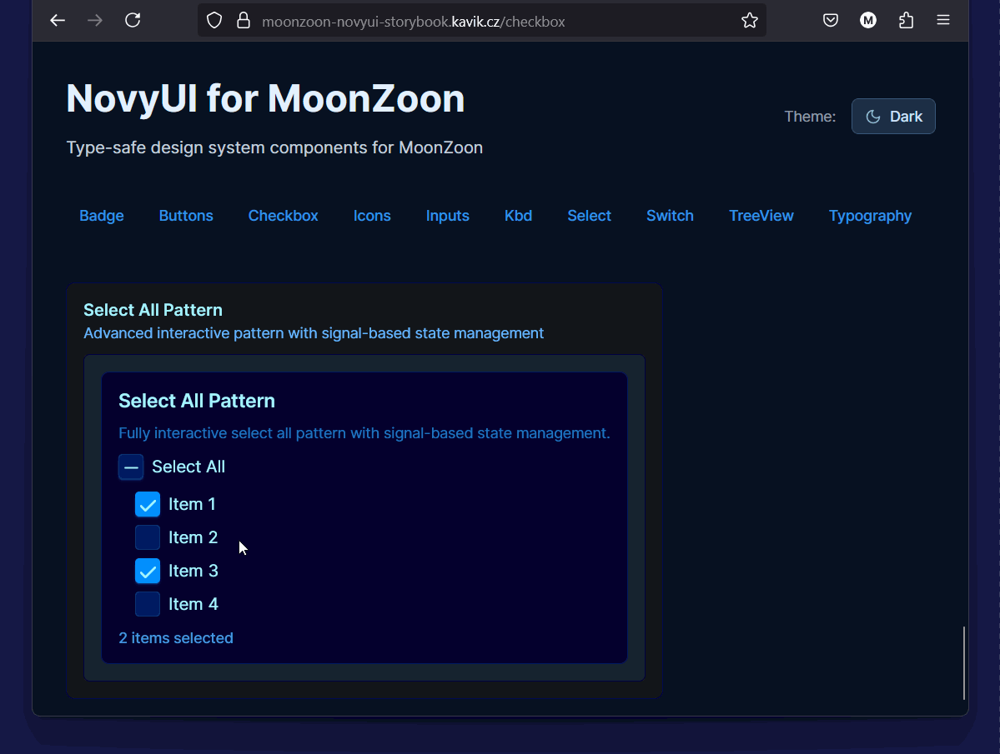

# NovyUI
> Timeless configurable design system.

_Warning: WIP - don't use yet_



### MoonZoon Storybook
- **Live: [moonzoon-novyui-storybook.kavik.cz](https://moonzoon-novyui-storybook.kavik.cz/)**
- NovyUI for Rust fullstack framework [MoonZoon](https://github.com/MoonZoon/MoonZoon)
- Both Storybook and components are written with NovyUI in Rust
- Source: [./moonzoon-novyui](moonzoon-novyui)

### Vue Storybook
- **Live: [vue-novyui-storybook.kavik.cz](https://vue-novyui-storybook.kavik.cz/)**
- NovyUI Vue/Typescript components
- Storybook is [Storybook.js](https://github.com/storybookjs/storybook)
- Source: [./storybook](storybook)

### Boon Storybook
- NovyUI for programming language [Boon](https://github.com/BoonLang/boon)
- Both Storybook and components are written with NovyUI in Boon

---

### Timeless?

You'll always need buttons, checkoxes and inputs in your apps. TODO [ best practices, paterns, knowledge, implementations, design files, for both humans and AI, underestamated / hard / boring to create one / blocks/pages neeed to show patterns and learn best practices]

### Configurable?

TODO [ Tooling / variants, my design examples, automatic asset download, pattern to create new custom components ]

---

Questions ▷ martin@kavik.cz

---

## Contributing [WIP]

To contribute to NovyUI, please validate the documentation and asset files before creating a pull request. This helps keep the design system consistent and implementation-ready.

If you don't have Deno installed, you can get it from [deno.com](https://deno.com/).

### Components, Blocks, and Pages markdown enforcement

NovyUI documentation is organized by type, with each type listed in its own table of contents file:
- `pages.md` (pages)
- `blocks.md` (blocks)
- `components.md` (components)

To validate the documentation, run the relevant script:

```sh
deno run --allow-read scripts/page-markdown-enforcer.ts      # For pages

deno run --allow-read scripts/block-markdown-enforcer.ts     # For blocks

deno run --allow-read scripts/component-markdown-enforcer.ts # For components
```

Or run all checks at once:

```sh
deno run --allow-read --allow-run scripts/all-markdown-enforcer.ts
```

Each script will:
- Check that documentation files and structure match the design system requirements for that type
- Report any missing or misplaced documentation files
- Print a ✅ message when the documentation structure is valid

### Font asset enforcement

To ensure all required font files are present and correctly named, run:

```sh
deno run --allow-read --allow-write --allow-net scripts/font-asset-enforcer.ts
```

This script will:
- Download and extract the latest Inter and JetBrains Mono font releases if needed
- Place and rename only the required `.woff2` and `.ttf` files in `/assets/fonts`
- Remove any orphaned font files not listed in `tokens/fonts.md`
- Print a ✅ message when all font files are in sync

### Icon asset enforcement

To ensure all required icon files are present, correctly named, and synchronized with Lucide, run:

```sh
deno run --allow-read --allow-write --allow-net scripts/icon-asset-enforcer.ts
```

This script will:
- Parse `tokens/icons.md` and strictly enforce that all icon tokens use the exact Lucide icon filenames
- Download and extract only the required SVG icons from the latest Lucide release
- Place the icons in `/assets/icons` and remove any orphaned icon files not listed in `tokens/icons.md`
- Print a ✅ message when all icon files are in sync

### Pattern asset enforcement

To ensure all required SVG pattern files are present and correctly named, run:

```sh
deno run --allow-read --allow-write --allow-net --allow-run scripts/pattern-asset-enforcer.ts
```

This script will:
- Parse `tokens/patterns.md` and strictly enforce that all pattern tokens use the exact pattern slugs
- Download and extract the SVG for each pattern from the official Hero Patterns zip (e.g. `https://heropatterns.com/svg/{slug}.zip`)
- Place the SVGs in `/assets/patterns` and remove any orphaned pattern files not listed in `tokens/patterns.md`
- Ensure the Hero Patterns license file is present
- Print a ✅ message when all pattern files are in sync

## Documentation Structure Rules

<!-- RULE: Every component, block, and page markdown file must follow these rules. -->

1. **Token Usage Table**
   - Every component, block, and page file must include a "Token Usage" table listing all relevant UI parts, the token used, and a short description.
   - Example:

     | Part        | Token Example      | Description                |
     |-------------|-------------------|----------------------------|
     | Background  | color.primary.7   | Main button background     |
     | Text        | color.neutral.11  | Button label               |
     | Border      | color.primary.5   | Border color               |
     | Radius      | radii.2           | Border radius              |
     | Shadow      | shadow.1          | Button shadow              |

2. **State/Variant Documentation**
   - Explicitly document all UI states (default, hover, active, disabled, focus, etc.) and variants.
   - For each state/variant, specify which tokens change and how.
   - Example:
     - **Default:**  
       - Background: `color.primary.7`
       - Text: `color.neutral.11`
     - **Hover:**  
       - Background: `color.primary.8`
     - **Active:**  
       - Background: `color.primary.9`
     - **Disabled:**  
       - Background: `color.neutral.3`
       - Text: `color.neutral.7`
     - **Outline Variant:**  
       - Border: `color.primary.7`
       - Background: `color.transparent`

3. **Accessibility Section**
   - Include an expanded accessibility section covering:
     - Keyboard navigation (tab order, shortcuts, etc.)
     - ARIA roles and attributes
     - Color contrast and focus indicators (with token references)
     - Any additional accessibility considerations

4. **Consistent Token Use**
   - All visual properties (color, spacing, radius, shadow, etc.) must be described using tokens from `/tokens`.
   - No hardcoded values for visual properties in documentation.

5. **Reference Sync and ToC Listing**
   - All references (blocks in pages, components in blocks, etc.) must use correct relative paths and be kept in sync.
   - Every item must be listed in its respective table of contents file (`components.md`, `blocks.md`, `pages.md`).

6. **Style Consistency**
   - Do not break or remove any `<!-- RULE:... -->` comments, templates, or formatting in the structure files.
   - Integrate new requirements using the same style and conventions as the rest of the files (e.g., add new rules as `<!-- RULE:... -->` blocks, update templates in-place, etc.).
   - If adding new sections, use the same heading and comment conventions as existing sections.
   - Review the files after changes to confirm style and structure are consistent.

7. **Synchronize with Templates**
   - Whenever changes are made to documentation structure or templates, ensure corresponding updates are made in both this section and Section 4 (Component/Block/Page Templates), and vice versa. Cross-reference changes and keep both sections in sync.

<!-- END RULES -->

## Run all documentation and asset enforcers

To check all documentation types and asset files in a single step, run:

```sh
deno run --allow-read --allow-write --allow-net --allow-run scripts/all-enforcer.ts
```

This script will:
- Run all markdown enforcers (components, blocks, pages)
- Run the font asset enforcer
- Run the icon asset enforcer
- Print a ✅ message when everything is valid and in sync

## Funding

This project is funded through [NGI Zero Core](https://nlnet.nl/core), a fund established by [NLnet](https://nlnet.nl) with financial support from the European Commission's [Next Generation Internet](https://ngi.eu) program. Learn more at the [NLnet project page](https://nlnet.nl/project/NovyWave).

[](https://nlnet.nl)
[](https://nlnet.nl/core)
